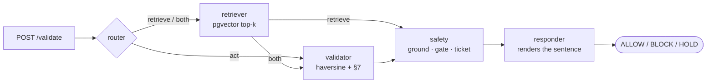

# NOTAM-Guard

**A compliance gate that decides whether a drone flight may launch — and refuses to guess.**

Given a flight plan (`lat, lon, alt, drone_id`), NOTAM-Guard returns `ALLOW`, `BLOCK`
or `HOLD`, with the regulation it relied on and the retrieved text that supports it.

<p>
  
  
  
  
  
  
  
</p>

## The design problem

The easy version of this project retrieves some regulations, asks a language model
whether the flight is legal, and prints the answer. That system fails in the way that
matters: when the database is down or the retriever misses, it still produces a
confident `ALLOW`.

NOTAM-Guard is built around three constraints instead.

**The language model never decides.** Verdicts come from
[`src/tools.py`](src/tools.py) — haversine distance against parsed NOTAM circles and
the DGCA §7 ceiling. The LLM routes the request and writes the sentence a human
reads. It cannot turn a `BLOCK` into an `ALLOW`, because it is never asked.

**Every citation must be shown, not asserted.** The validator names the rule it
applied; [`src/core/citations.py`](src/core/citations.py) then checks that reference
actually appears in a retrieved chunk. A citation that cannot be found is marked
`grounded: false` and the flight is held. The API returns the supporting excerpt so
the operator can check the reasoning rather than trust it.

**It fails closed.** Retrieval errors raise instead of returning a fallback, so a
dead vector store produces `HOLD`, never `ALLOW`. Restrictions the parser cannot
evaluate — NOTAM 09/04 in the sample corpus declares a 5km no-fly but states no
coordinates — are reported as warnings and subtract from confidence rather than being
silently dropped.

## How a decision is made



The router's choice is a real branch in the LangGraph state machine
(`add_conditional_edges`), so a plain flight plan with no regulatory question takes
the `act` route and skips retrieval — and is then **held**, because a flight nothing
was checked against has not been cleared.

`safety` is the only node that sets a verdict, and it runs before `responder`, so the
rendered text always describes a decision that was already final.

## Verdicts

| Verdict | Meaning | Human gate |
|---|---|---|
| `ALLOW` | Geometry is clear and every citation was found in the retrieved corpus | no |
| `BLOCK` | A ceiling or NOTAM restriction is breached | always |
| `HOLD` | The system could not justify a decision — retrieval failed, a citation was ungrounded, or nothing was checked | always |

Confidence starts at 1.0 for a clean deterministic result and is reduced by named
defects: −0.15 per restriction that could not be evaluated, −0.40 per ungrounded
citation. Below 0.75 an `ALLOW` becomes a `HOLD`. A `BLOCK` is never downgraded —
blocking is the safe direction — but it always reaches a human, because refusing a
mission has a cost too. The policy is one function:
[`src/core/safety.py`](src/core/safety.py).

## Quickstart

```bash
git clone https://github.com/maczeo11/notam-guard.git && cd notam-guard
python -m venv .venv && .venv/Scripts/activate   # macOS/Linux: source .venv/bin/activate
pip install -r requirements-dev.txt
cp .env.example .env

# Runs with no infrastructure: lexical retrieval, rule-based router, in-process memory.
VECTOR_ADAPTER=memory LLM_ADAPTER=rule python -m pytest    # 72 passing
VECTOR_ADAPTER=memory LLM_ADAPTER=rule python src/eval.py
```

With Postgres, Redis and the web UI:

```bash
docker compose up -d
python -m src.ingest --docs "data/dgca_car.txt" "data/notams/*.txt"
uvicorn src.app:app --reload --port 8000    # http://localhost:8000/docs
```

```bash
curl -X POST http://localhost:8000/validate -H "Content-Type: application/json" \
  -d '{"lat":18.53,"lon":73.84,"alt":120,"drone_id":"D12"}'
```

```json
{
  "verdict": "BLOCK",
  "reason": "NOTAM 09/03: max 100m within 1.0km, flight at 120m and 0.00km away — reduce to 80m",
  "confidence": 0.8,
  "citations": ["NOTAM 09/03"],
  "evidence": [{"ref": "NOTAM 09/03", "grounded": true,
                "excerpt": "NOTAM 09/03 Pune Site: Crane 100m at 18.53,73.84 radius 1km…"}],
  "warnings": ["NOTAM 09/04 states a restriction but no usable coordinates/radius — could not be evaluated geometrically"],
  "requires_human": true,
  "ticket_id": "T-9F2A11"
}
```

## API

| Method | Path | Purpose |
|---|---|---|
| `POST` | `/validate` | Decide one flight plan. Optional `scheduled_for` evaluates NOTAM windows at a future instant. |
| `GET` | `/notams` | The parsed corpus, including which records could not be geolocated. |
| `GET` | `/ticket/{id}` | Status of a held flight. `404` if unknown. |
| `POST` | `/approve/{id}` | Close the human gate on a held flight. |
| `GET` | `/drone/{id}/history` | Recent tickets for one drone. |
| `GET` | `/health` | Liveness. |

## Architecture

Ports and adapters. Five ports in [`src/core/ports.py`](src/core/ports.py) —
vector store, memory, tickets, NOTAM repository, LLM — each with a real adapter and a
test double, resolved in [`src/core/container.py`](src/core/container.py). Nothing in
the decision path imports psycopg2, redis or an LLM SDK, which is why the whole suite
runs in about a second with no infrastructure.

```
src/
├── core/
│   ├── config.py          # every environment variable, read in one place
│   ├── domain.py          # FlightPlan, Notam, Citation, Verdict, Decision
│   ├── ports.py           # the five abstract boundaries
│   ├── container.py       # composition root + test overrides
│   ├── notam_parser.py    # NOTAM free-text → structured record
│   ├── citations.py       # extract references, check they were retrieved
│   ├── safety.py          # the verdict policy, in one function
│   ├── chunking.py        # shared by ingest and the in-memory store
│   ├── tracing.py         # LangSmith spans, no-op when tracing is off
│   └── errors.py          # typed failures the graph reacts to
├── adapters/              # pgvector, redis, tickets, NOTAM files, LLMs
├── graph.py               # the LangGraph state machine
├── tools.py               # deterministic airspace checks
├── app.py                 # FastAPI
├── ingest.py              # corpus → pgvector
└── eval.py                # scores the golden set
tests/                     # 72 tests, no infrastructure required
```

Swap any adapter with an environment variable: `VECTOR_ADAPTER=memory|pgvector`,
`LLM_ADAPTER=rule|groq|ollama`. Redis and Postgres degrade to in-process
equivalents when unreachable — except retrieval, which fails closed by design.

See [docs/ARCHITECTURE.md](docs/ARCHITECTURE.md) for the state machine and the
failure modes, [docs/EVAL.md](docs/EVAL.md) for what the numbers measure and what
they do not, and [docs/SETUP.md](docs/SETUP.md) for configuration.

## Evaluation

```
  cases                    16
  routing_accuracy         1.0
  verdict_accuracy         1.0
  retrieval_hit_rate       1.0
  grounded_citation_rate   1.0
  held_for_human           2
  p50_ms                   2.3
```

Four separate numbers, because a perfect verdict score would otherwise hide a
retriever that returns nothing useful. **Read [docs/EVAL.md](docs/EVAL.md) before
quoting these** — verdict accuracy scores deterministic arithmetic against a golden
set built from the same thresholds, so it is a regression check on boundary
behaviour, not evidence about the retrieval. The corpus is 8 chunks; the retrieval
number will not survive contact with a real one.

## Limitations

- The corpus is a 5-clause DGCA extract and 3 NOTAMs. Nothing here has been tested at
  realistic scale.
- The NOTAM parser handles the shapes in `data/notams/`. Real NOTAM formats (ICAO Q-codes,
  schedule expressions like `0600-1800 UTC daily`) are not implemented — recurring
  daily windows are currently treated as active for the whole date range.
- `InMemoryVectorAdapter` is IDF-weighted lexical overlap, not embeddings. It exists so
  the pipeline runs without Postgres; the pgvector adapter is the real path.
- Terrain, weather, airspace class and other traffic are not modelled.
- No authentication. Not deployed anywhere.

## License

MIT — Komma Bhanu Teja · `bhanu0005a@gmail.com` · [github.com/maczeo11](https://github.com/maczeo11)
