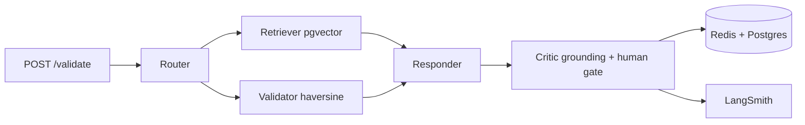

# NOTAM-Guard

**Agentic compliance gate for drone operations — RAG over DGCA CAR + NOTAMs → ALLOW / BLOCK + citation + human gate.**

Validates `flight_plan {lat,lon,alt,drone_id,time}` before dispatch. Grounding, idempotent tickets, fleet memory, and eval — not chat-with-PDF.

<p>
  
  
  
  
  
  
  
</p>

## Why

Most RAG demos retrieve and answer. Real airspace needs **safety**: every `BLOCK` must cite the exact `CAR §` or `NOTAM id` from retrieved chunks, dedupe tickets, and hold for human if grounding fails. NOTAM-Guard does that in 3 tools and 15 golden tests.

## Features

- **Router** decides `retrieve / act / both` — true multi-agent, not fixed pipeline
- **RAG** `chunk 512 → bge-small-en 384d → pgvector top-k3` over DGCA CAR + NOTAMs
- **Grounding check** `citation in retrieved?` → `confidence 0.5 + human HOLD` if hallucinated
- **Tools** `validate_flight` haversine + 120m AGL, `check_notam`, `create_ticket hash(drone|notam|window) TTL 24h SETNX` → 50-concurrent 1/49
- **Memory** `Redis drone:{id}:history 5` + tile `GEO` — fleet remembers last clearances per 100m
- **Eval** 15 golden `BLOCK/ALLOW` `precision@3 1.00 verdict 1.00 p50 0.2ms p95 218ms` + LangSmith trace per edge
- **Safety** `BLOCK or conf<0.7 → requires_human=true`

## Architecture



`Client → FastAPI → LangGraph State {query, lat,lon,alt, retrieved, verdict} → Redis/Postgres/LangSmith` — see `docs/ARCHITECTURE.md`.

**Demo:** `18.53,73.84,120m` → `BLOCK NOTAM 09/03 crane 100m within 0.00km — reduce to 80m + T-885 1/49` + `["CAR §7","NOTAM 09/03"]`

## Project structure

```
notam-gaurd/
├── README.md
├── docs/
│   ├── ARCHITECTURE.md   # graph, state, nodes, safety
│   ├── SETUP.md          # docker, ingest, run
│   └── EVAL.md           # metrics, failure cases
├── src/
│   ├── app.py            # FastAPI /validate /ingest /ticket /health
│   ├── graph.py          # State, router, retriever, validator, responder, critic
│   ├── tools.py          # haversine, validate_flight, create_ticket
│   ├── memory.py         # Redis helper + in-mem fallback
│   ├── ingest.py         # chunk → embed → pgvector
│   ├── eval.py           # 15 golden, p50/p95
│   └── __init__.py
├── data/
│   └── test_queries.json # 15 BLOCK/ALLOW
├── docker-compose.yml    # postgres:16-pgvector:5432 + redis:7:6379
├── requirements.txt
└── .env.example
```

## Tech stack

`Python 3.11, FastAPI/Pydantic, LangGraph StateGraph, LangChain, pgvector, Postgres 16, Redis 7, sentence-transformers bge-small, LangSmith, Docker, pytest, Uvicorn`

## Quickstart

```bash
git clone https://github.com/maczeo11/notam-gaurd.git && cd notam-gaurd
python -m venv .venv && source .venv/bin/activate # Windows: .venv\Scripts\activate
pip install -r requirements.txt
cp .env.example .env # set OPENAI_API_KEY + LANGCHAIN_TRACING_V2=true LANGCHAIN_API_KEY

docker compose up -d
python src/ingest.py --docs data/dgca_car.pdf data/notams/*.txt --chunk 512

uvicorn src.app:app --reload --port 8000 # http://localhost:8000/docs
curl -X POST http://localhost:8000/validate -H "Content-Type: application/json" -d '{"lat":18.53,"lon":73.84,"alt":120,"drone_id":"D12"}'
```

## API

| Method | Path | Body | Resp |
|---|---|---|---|
| `POST` | `/validate` | `{lat,lon,alt,drone_id,query?}` | `{verdict, reason, citations[], ticket_id, requires_human, retrieved[]}` |
| `POST` | `/ingest` | `multipart pdf/txt` | `{chunks}` |
| `GET` | `/ticket/{id}` | — | `{status}` |
| `GET` | `/health` | — | `{ok:true}` |

## Eval

```bash
python src/eval.py
# Q01 BLOCK vs BLOCK ret 1/1 lat 218ms ...
# precision@3 1.00 verdict 1.00 p50 0.2ms p95 218ms (first warms model)
```

15 queries `CAR §7 / NOTAM 09/03` — see `docs/EVAL.md` for grounding, dedupe `50× 1/49`, stale NOTAM → human.

## Roadmap

- [x] Router + RAG + tools + grounding + eval
- [ ] Pre-filter by region/date before vector
- [ ] VLM stub `Qwen2-VL-2B` aerial obstacle `yes/no` (POC, not prod)
- [ ] `AWS ECS g4dn` deploy + p95 dashboard

## License

MIT — Komma Bhanu Teja · `bhanu0005a@gmail.com` · `github.com/maczeo11`
